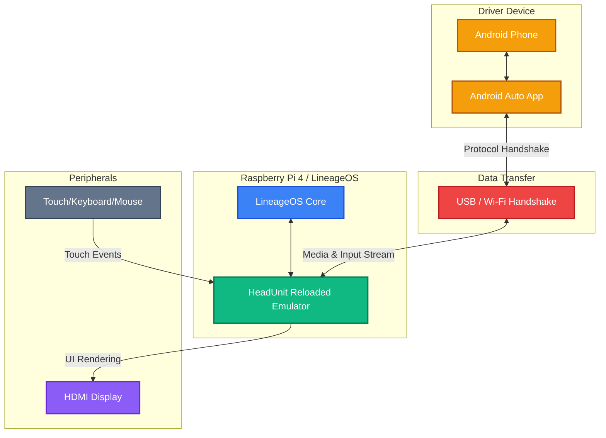

# Android Automotive Infotainment System Prototype

Android Automotive Infotainment System Prototype using Raspberry Pi 4 and AOSP-Based LineageOS.

## Project Domain
Embedded Systems | In-Vehicle Infotainment Systems | Android Auto Projection | Raspberry Pi Prototyping

## Overview
This project is a functional prototype of a low-cost automotive infotainment head unit designed to simulate the smartphone projection workflow used in modern Android Auto-enabled vehicles. The system uses a Raspberry Pi 4 as the embedded processing platform, boots an AOSP-based custom Android operating system (LineageOS), and integrates HeadUnit Reloaded (HUR) to emulate an Android Auto-compatible automotive receiver.

The final setup allows a driver smartphone to connect through USB or Wi-Fi and project Android Auto content such as navigation, music, and communication applications onto an HDMI-connected display, mimicking a real in-vehicle infotainment (IVI) dashboard.

## Problem Statement
Modern cars and EVs use intelligent infotainment systems that allow drivers to mirror smartphone navigation, calls, messages, and media onto a central dashboard screen using Android Auto or Apple CarPlay. However, commercial automotive infotainment hardware is expensive and proprietary. 

The objective is to build a low-cost prototype that replicates the essential Android Auto projection behavior using consumer-grade embedded hardware and open-source Android software. The main engineering challenge is that AOSP/LineageOS running on Raspberry Pi does not natively support certified Android Auto receiver services, requiring emulation middleware.

## Architecture

## Hardware & Software Stack

### Hardware Components
* **Raspberry Pi 4 Model B:** Quad-core ARM Cortex-A72 processor
* **MicroSD Card (16GB+):** Primary boot storage for OS image
* **HDMI Monitor:** Simulates vehicle infotainment dashboard display
* **Android Smartphone:** Driver device running Android Auto services
* **USB Data Cable & Wi-Fi Hotspot:** For wired and wireless projection
* **USB Keyboard/Mouse:** For initial OS setup

### Software Stack
* **OS:** LineageOS for Raspberry Pi 4 (AOSP based)
* **Middleware:** HeadUnit Reloaded (HUR APK)
* **Flashing Utility:** Raspberry Pi Imager / Balena Etcher
* **Host Application:** Android Auto (on smartphone)

## Technical Architecture Decisions

### Why LineageOS instead of Raspbian?
Raspbian is Linux-based and useful for generic embedded development, but Android Auto projection requires Android framework compatibility, media handling, APK installation, and Android UI services. LineageOS is built on AOSP and provides the necessary runtime environment to execute HUR.

### Why is HUR Required?
AOSP or LineageOS alone does not include Google Automotive Services or the proprietary projection services required for Android Auto. HUR acts as a virtual Android Auto head unit emulator, performing the receiver-side communication and acting as the middleware bridge between the smartphone and the Raspberry Pi.

## Setup Procedure

1. **Download LineageOS:** Obtain Raspberry Pi 4 compatible LineageOS zip.
2. **Flash OS:** Use Balena Etcher/Raspberry Pi Imager to write the image to the SD card.
3. **Boot Initialization:** Insert SD card, connect HDMI, peripherals, and power.
4. **Android Configuration:** Complete welcome setup, configure Wi-Fi, enable installation from unknown sources.
5. **Install HUR:** Transfer and install the HeadUnit Reloaded APK.
6. **Configure HUR:** Set connectivity to manual mode, enable USB/Wi-Fi receiver behavior.
7. **Configure Smartphone:** Ensure Android Auto is installed, grant USB projection permissions.
8. **Establish Projection:** Connect the phone via USB. Open HUR on the Pi to initiate the handshake and start the session.
