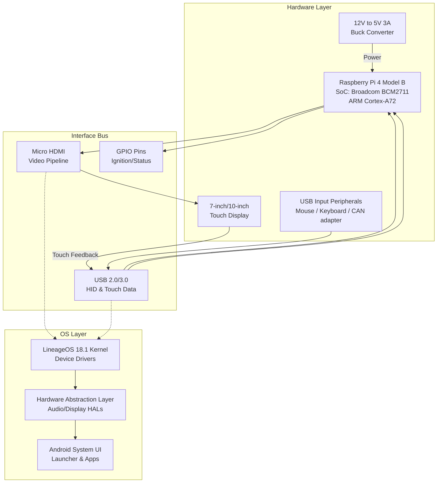

# Android Automotive Infotainment Prototype (Raspberry Pi 4)

This repository contains the hardware configuration, interface settings, and ADB deployment scripts for an embedded Android-based Infotainment system running on a Raspberry Pi 4. The project utilizes Android (via LineageOS 18.1/Android 11) to simulate a vehicle digital cockpit environment.

## Overview

The primary focus of this project is the hardware-software integration of an automotive HMI (Human-Machine Interface). Instead of compiling the AOSP from source, this project leverages a pre-built LineageOS image, focusing primarily on configuring the physical interfaces (HDMI for the display pipeline, USB for touch/peripherals) and optimizing system constraints such as latency and boot configuration.

### Hardware-Software Architecture



## Setup Instructions

### 1. OS Deployment
1. Download a compatible LineageOS (Android 11+) image for Raspberry Pi 4 (e.g., KonstaKANG builds).
2. Flash the `.img` file to a high-speed MicroSD card (Class 10 minimum) using BalenaEtcher or `dd`.

### 2. Hardware Configuration
The standard Android image may not correctly detect all HDMI displays or output proper resolution/timings for raw automotive panels.
- Mount the `boot` partition of the flashed SD card.
- Replace the default `config.txt` with the optimized `boot_config.txt` provided in this repository.

### 3. Application Sideloading (ADB)
Once the system boots, essential automotive applications (like media aggregators or navigation mocks) were installed over Wi-Fi/Ethernet using ADB.
Run the provided script to batch install APKs and adjust screen density (DPI):
```bash
./adb_setup.sh <PI_IP_ADDRESS>
```

## System Constraints & Optimizations
- **Display Latency:** Resolved by forcing specific HDMI timings and disabling overscan via the boot partition configuration.
- **Power Delivery:** The Pi 4 under load requires consistent 5V/3A. Used an automotive-grade DC-DC buck converter to step down vehicle 12V supply to ensure no undervoltage throttling during UI rendering operations.
